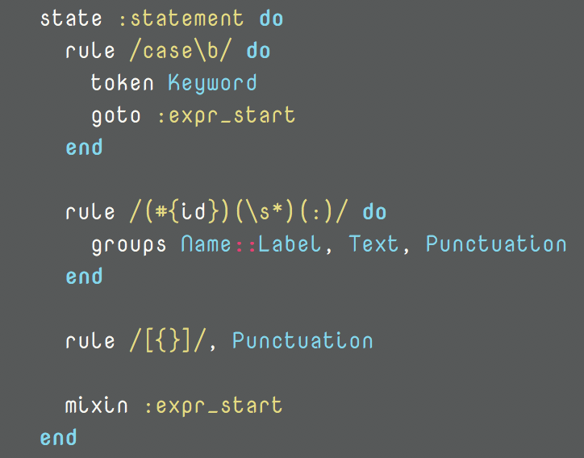
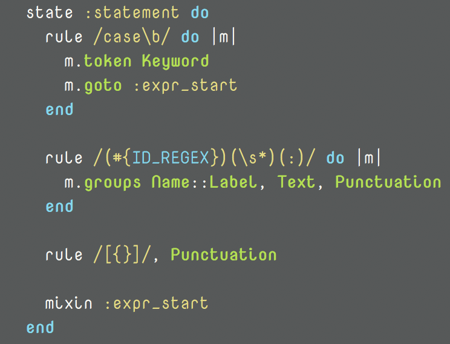

<!-- $theme: gaia -->

# «le noir que j'ai créé»

## @MakeNowJust qui écrit Quine

<!--
「るのわーるくじゃくりー」というタイトルで発表します。@MakeNowJustです。よろしくお願いします。
-->

- - -

# bonsoir

<!--
「ぼんそわーる」。タイトルはフランス語で「私の作ったノワール」という意味になります。
さっきのボクのフランス語の発音はかなり怪しいので真に受けないでください。
-->

- - -

# who are you?

- 20 years old
- undergraduate student learning German literature
- accounts:
  * GitHub: @MakeNowJust
  * Twitter: @make_now_just
- work for space pirates LLC.

<!--
まずは自己紹介です。20歳です。大学でドイツ文学を専攻しています。
インターネットでは「さっき作った」とか「make now just」とかいう変な名前で活動しています。make now justという語順は明らかに間違っているので注意してください。
というわけで本題です。
-->

- - -

# syntax highlight

<!--
突然ですがみなさん、シンタックスハイライトは好きですか？
シンタックスハイライトというのはソースコードに色を付けるやつです。
ボクは結構好きです。
-->

- - -

# my works related with Crystal and syntax highlight

- created syntax definition of Crystal
  * for highlight.js
  * for prism.js
  * for CodeMirror
- fixed many bugs of syntax highlight on `crystal doc`
- implemented syntax highlight for `icr`

<!--
その証拠というわけでもないのですが、今までにやったことでシンタックスハイライトとCrystalに関連することをまとめてみるとこんなものがありました。
highlight.jsとかprism.js、CodeMirrorのCrystal向けの構文ファイルを作ったりとか、`crystal doc`の内部で使ってるシンタックスハイライタを直したりとか、あと`icr`っていうCrystalのREPLがあるんですけど、それ向けのシンタックスハイライタを実装したりしました。
DEMO: `icr`
-->

- - -

# NOIR

<!--
さて、タイトルにあったノワールですが‥
-->

- - -

# what is NOIR?

- syntax highlight library for Crystal
- made by @MakeNowJust (me!)
- port of Ruby's library **rouge**
  * one of most famous syntax highlight libraries
  * e.g. used by Jekyll in default
- "black" in French

<!--
NOIRはCrystal向けのシンタックスハイライトライブラリです。
タイトルでも言いましたがボクが作りました。
RubyのrougeというライブラリをCrystalに移植してます。rougeはそこそこ有名なライブラリで例えばJekyllの標準のシンタックスハイライタだったりします。今GitHub Pagesでソースコードを含むような記事を書くとrougeで色付けされるはずです。
ちなみに名前はフランス語で「黒」という意味です。これはrougeがフランス語で「赤」なことと対応しています。«le rouge et le noir»、スタンダールの「赤と黒」が元ネタです。
-->

- - -

# ET NOIR

- CLI for NOIR
- `etnoir` command
- **syntax highlight on terminal**
- also outputs HTML

<!--
また、NOIRのCLIツールとして、ET NOIRというコマンドも用意してあります。
ET NOIRの面白いところは、エスケープシーケンスを使ってシンタックスハイライトしたファイルを出力できるところです。
DEMO: `etnoir highlight`
あと、一応HTMLを吐いたりとか、テーマに対応するCSSを吐いたりすることもできます。
-->

- - -

# current status

- early stage 😅
- since 2017/11/6 (24 days ago)
- few supported languages (4 languages available)
  * Ruby, JavaScript, Python and Crystal
- few themes (3 themes available)
  * Monokai and Solarized Dark/Light

But...

<!--
ではNOIRの開発状況なのですが、まだproduction readyとはいい難い状況です。
というのもNOIRは今月の6日に開発を始めたばかりのライブラリで、まだ4種類の言語のシンタックスハイライトしかサポートしておらず、テーマも3種類しかありません。もう少し種類が欲しいな、と思います。
ですが、これは大きな問題ではありません。
-->

- - -

# rouge

<!--
これはrougeのJavaScriptの構文の定義を抜き出したものです。
-->

- - -

# NOIR

<!--
そして、これがNOIRの同じ部分です。どうでしょうか？　非常によく似ているのではないかと思います。
大きな違いは`rule`がブロックを取るときに、Crystalではキャプチャしたブロックではコンテキストを切り変えることができなかったので、第一引数を通じてメソッドを呼ぶようになっているくらいです。実際、構文定義をするだけならNOIRとrougeの違いはこれだけだと思います。
テーマも、大体rougeから簡単に移植できるようになっています。
実はrougeの書き方に近付けるために裏ではマクロを駆使してすごいことをしているのですが、その辺の説明は今回は省略します。
-->

- - -

# welcome your contribution

<!--
というわけで、rougeから構文の定義を移植してくることは簡単なので、NOIRにコントリンビュートしてください。
僕も時間があれば増やしていきたいと思っているのですが、なかなか時間が割けないのです。
よろしくお願いします。
-->

- - -

# merci 😆

<!--
では「めるしー」。ご清聴ありがとうございました。
-->